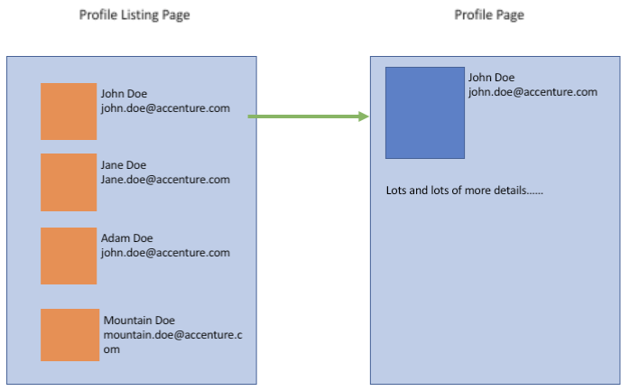

# Homework
Time is provided only with indicative propose. You ARE NOT restricted in time matter.

### Task 2 (5 min)

You have the following mockup code in your project (which is used also in multiple other places):

```js
class Provider {  
  /** 
   * Gets the weather for a given city 
   */  
  static getWeather(city) {  
    return Promise.resolve(`The weather of ${city} is Cloudy`)  
  };  
  /** 
   * Gets the weather for a given city 
   */  
  static getLocalCurrency(city) {  
    return Promise.resolve(`The local currency of ${city} is GBP`)  
  };  
  /** 
   * Given Longtitude and latitude, this function returns a city 
   */  
  static findCity(long, lat) {  
    return Promise.resolve(`London`)  
  };  
};  
```

You need to write code which would:

1. Find and print in console the city located at latitude/longtitude 51.5074 and 0.1278 accordingly 
2. Print in console the weather for the city located at lat/long = 51.5074 and 0.1278
3. Print in console in one line the weather and currency for a given city (London)


#### Solution 
```js
Provider.findCity(51.5074, 0.1278).then(console.log)
Provider.findCity(51.5074, 0.1278).then(Provider.getWeather).then(console.log)

  (async (city) => {
    const weather = await Provider.getWeather(city)
    const currency = await Provider.getLocalCurrency(city)
    console.log(weather + " " + currency)
  })("London")
```

### Task 3 (25 min)

Look at this two-page app design for small company contact book:



The management ask to use React and NodeJS as base technology for this app (because of skills across the company). In future the company hope to build more functions around this app. You are asked to provide initial technical design for this app which should include the following points:
#### Solution (Q/A)    

1. Frontend part:

    a. Tools, frameworks, npm libraries you plan to use and why
    ```
    - typescript for type safety and code confidence
    - nextjs for serverside rendering and SEO
    - jest, testing-library for testing and code confidence
    - eslint, prettier for linting and formatting 
    - husky for checking errors, linting and formatting on commit
    - react-query or swr for serverside data caching
    - zustand or valtio for straight forward state management
    - chakra-ui for styling. It's flexible and easy to use css in js library that  provides prebuild components and great accessibility out of the box
    ```

    b. Directory structure for source code folder
    ```
    nextjs already enforces some structure like /peges and /pages/api folders 
    In addition to that I think there should be /componets /globals /utils /store folders
    ```

    c. List of components which you’ll implement (with short description)
    ```
    - ProfileListPage - a page for profile listing
    - ProfileList - contains list of profiles
    - ProfileItem - contains info/ui for single profile
    - ProfilePage - a page for single profile
    ```

    d. For one of the components also provide in which directory/-ies component’s file/-es will be located 
    ```
    - /pages/ProfileListPage
    - /pages/ProfilePage
    - /components/ProfileList/index.tsx
    - /components/ProfileItem/index.tsx
    ```

    e. Benefits/drawbacks comparing with traditional (not-SPA) app approach
    ```
    Pros
      - SPA is fast
      - Easier to debug with frontend dev tools
      - Backend code can be reused to build multiple frontends (web/mobile)
    Cons
      - If it's not SSR framewor like nextjs (i.e. react) it's not an easy task to make website SEO friendly
      - Could take more time to initialy download/load the app
    ```

    f. Any other comments and suggestions
    ```
    If we need the POC here and now then forget the above.
    Just npx create-next-app or create-react-app and start delivering
    ```

2. Backend part:

    a. Short description of API – URI, format, why needed
    ```
    /
    /profile/some-id-goes-here
    if the profile is something else i.e. 'book' I think slugified url makes sense. Also better for SEO
    ```

    b. Framework
    ```
    - nextjs
    - express
    - aws api gateway, dynamo db or just Amplify
    ```

    c. Any other comments and suggestions
    ```
    Maybe just some headles CMS would do what's needed without any backend hassle. 
    It depends on project scope and requirements
    ```
### Task 4 (20 min)

You have been tasked with creating a helper function that will be used to determine the output of an array of data.
Each element of the array has the following structure:

```json
{  
    state: <String> // a state to go to  
    errorCode: <String> // optional error code  
}  
```

The states have different functionalities:

* 'processing' = delay by 2 seconds, then fetch the next state
* 'error' = handle the error code provided (see below)
* 'success' = return from the helper with the object: { title: 'Order complete' message: null }

Handling error codes:

* 'NO_STOCK' = return from the helper with an object: { title: 'Error page', message: 'No stock has been found' }
* 'INCORRECT_DETAILS' = return from the helper with an object: { title: 'Error page', message: 'Incorrect details have been entered' }
* null = return from the helper with an object: { title: 'Error page', message: null }
* undefined = return from the helper with an object: { title: 'Error page', message: null }

Example usage:

```js
getProcessingPage([{ state: 'processing' }, { state: 'error' }])
 ```


This code should return after 2 seconds with the object: { title: 'Error page', message: null }

To-do:
* Provide the code and a description of how to run it

Starting point:
```js
  /** 
   * Gets the processing page 
   * @param {array} data  
   */  
  function getProcessingPage(data) {  
    
  } 
 ```
  #### Solution

```js
  function getErrorMessage(errorCode) {
    if (errorCode === "NO_STOCK") {
      return { title: "Error page", message: "No stock has been found" }
    }
    if (errorCode === "INCORRECT_DETAILS") {
      return { title: "Error page", message: "Incorrect details have been entered" }
    }
    return { title: "Error page", message: null }
  }

  function getSuccessMessage() {
    return { title: "Order complete", message: null }
  }

  /** 
   * Gets the processing page 
   * @param {array} data  
   */  
  function getProcessingPage(data) {
    for (let item of data) {
      if (item.state === "processing") {
        new Promise((res, rej) => {
          setTimeout(res, 2000)
        })
      }
      if (item.state === "success") {
        return getSuccessMessage()
      }
      if (item.state === "error") {
        return getErrorMessage(item.errorCode)
      }
    }
  }
 ```

### Task 5 (20 min)

You are mid/senior developer in some big long-term project A. You will be participating in this project for a long time. During the Scrum planning there was the following user story: 

As external portal user 
When I open external portal and the portal has widget from the project’s A 
Then I should see red alert if the amount of fuel consumed by cars in the fleet with id=121 more than 10k litres during current month.

The information about the amount of litres will be receive through the following endpoint:

https://new.world.com/fleet/121
With the contract:

```json
{
  “id”: number, //id of the fleet
  “litres”: number, //the amount of fuel consumed by fleet
}
 ```

Later our PO (product owner, who is sales consultant in other department) want to add some more features to that widget and make it more customizable. But it will be much later. You agreed that one of the junior developers will take that user story. User story is delivered for code review. Junior developer has demonstrated it to PO and as PO opinion what he sees in the browser all is done well.  
Here will be the code from the junior developer. Please make code review (take in account that is only the first of multiple future code reviews):


```jsx
01:  import React, { useEffect, useState } from 'react';
02:  
03:  function App() {
04:    
05:      var [fuel, setFeul] = useState(0); // as in react we can using es6 features and var an be replaced with const
06:      var [alertText, setAlertTxt] = useState('Processing...');
07:  
08:      useEffect(() => {
09:        fetch('https://new.world.com/fleet/121')
10:          .then(response => response.json())
11:          .then(json => {
12:            setFeul(json);
13:            console.log(json);
14:          })
15:      }); // 
16:  
17:      useEffect(() => {
18:        if (!fuel) setAlertTxt('Processing...'); else
19:        if (fuel.litres > 0) setAlertTxt('Need to buy more fuel'); else 
20:        setAlertTxt('All is fine');
21:      }, [fuel])
22:  
23:      return (
24:        <div>
25:          <h1 style={alertText == 'Need to buy more fuel'? {color:"red"}:{}}>{alertText}</h1>
26:        </div>
27:      );
28:    
29:  }
30:  
31:  export default App;
 ```

To-do:
Please provide comments to the junior in the following format:
  * Line number;
  * Comment.

#### Solution

 - line 05: 
    - In react we can use modern javascript syntax (es6) and arguably `const` is more prefered than `var`. 
    - `setFeul` has a typo => `setFuel`
    - `fuel` should be initialized to expected primitive which in this case is an object
 - line 06: 
    - `setAlertTxt` should be `setAlertText`
    - Maybe just initialize with empty string. If we need to show the loading state then maybe it's better to handle it with a separate state like `const [isLoading, setIsLoading] = useState(true)`
 - line 09: 
    - Might be better to move the fetching logic for fuel to a separate helper function 
 - line 13: 
    - Remove console.log
 - line 15: 
    - Missing empty dependency array `[]`. We do not want to run this fetch function on every rerender
    - Idealy the dependency should be `[fleetId]` because we want to fetch fuel info based only on `fleetId`
 - line 17 - 21: 
    - It doesn't look that this logic fulfills the user story

- line 25:
   - Alert message shouldn't be as `h1` tag
   - I think it should be a background `color` rather than text `color`
   - As far as I can tell from the description, this user story is only about the error message. There should not be any other message displayed.


Here is another approach for implementing this user story. If we need a loading state I would probably handle the entire state logic with `useReducer` hook. 

**NB**: As a reviewer I would not implement the entire user story, this is just an example

```js
function fetchFuel(fleetId) {
  return fetch(`https://new.world.com/fleet/${fleetId}`).then((res) => res.json())
}

const TOO_MANY_LITRES_NUMBER = 10000

export default function Alert({ fleetId = "121" }) {
  const [fuel, setFuel] = useState({})
  const [alertMessage, setAlertMessage] = useState("")

  useEffect(() => {
    try {
      setAlertMessage("")
      fetchFuel(fleetId).then(setFuel)
    } catch (err) {
      setFuel({})
      setAlertMessage("Something went wrong")
    }
  }, [fleetId])

  useEffect(() => {
    if (fuel.litres > TOO_MANY_LITRES_NUMBER) {
      setAlertMessage("Fuel consumed by cars in the fleet is more than 10k litres during current month")
    } else {
      setAlertMessage("")
    }
  }, [fuel])

  if (alertMessage) {
    return (
      <div style={{ background: "red", padding: "16px" }}>
        <p>{alertMessage}</p>
      </div>
    )
  }

  return null
}
 ```

